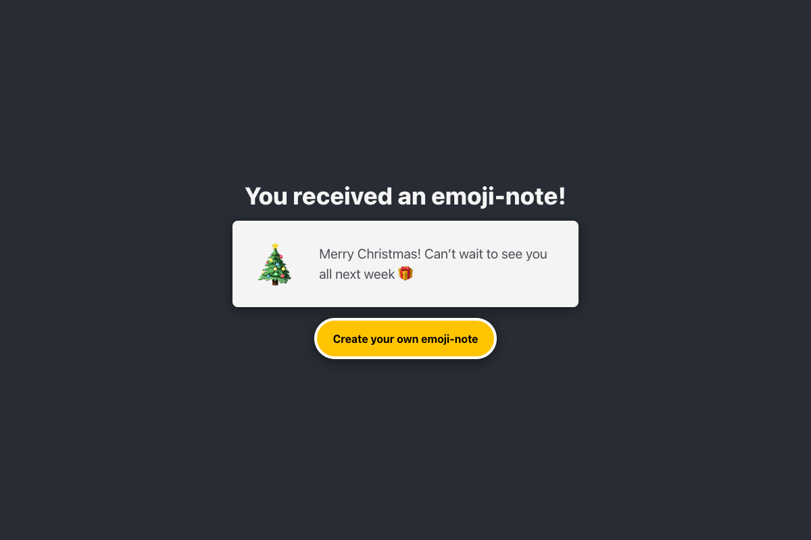

# 💌 Emoji-notes

[](https://github.com/regulardesigner/emojinotes/actions/workflows/ci.yml)

Send secret messages to your friends. Write a short note, pick an emoji, and share it through a private link or a QR code.



## Features

- Three-step creation flow (message → emoji → preview) with back navigation, inline validation and focus management
- The share page has its own URL (`/share/:token`), so a reload never loses the link
- Share with a private link: copy to clipboard, the native share sheet on mobile, or a QR code with the emoji in the middle
- Unguessable links: 128-bit random tokens generated on the server
- Accessible: semantic HTML, labelled controls, keyboard support, visible focus, live regions, `prefers-reduced-motion`

## Tech stack

| Layer    | Choice                                                                        |
| -------- | ----------------------------------------------------------------------------- |
| Frontend | React 19, TypeScript (strict), Vite, React Router 7, native CSS               |
| Backend  | Node 22, Express 5, Sequelize 6, Umzug migrations                             |
| Database | PostgreSQL in production, SQLite in development and tests (zero setup)        |
| Security | Helmet (CSP, HSTS…), rate limiting, input validation, no internal error leaks |
| Quality  | Vitest + Testing Library, `node:test` + Supertest, ESLint, Prettier           |
| Delivery | Multi-stage Dockerfile, Docker Compose, GitHub Actions CI, Dependabot         |

## Getting started

Requirements: Node 22.18+ (`nvm use` picks the version from `.nvmrc`).

```sh
npm install
npm run dev
```

Open http://localhost:5173. Vite serves the client with hot reload and proxies `/api` to the Express server on port 3000. In development, notes are stored in a local SQLite file (`emojinotes.dev.sqlite`), so no database setup is required.

### Production-like stack with Docker

```sh
docker compose up --build
```

Open http://localhost:3000. The app runs with a PostgreSQL database. Migrations run automatically on startup.

## Scripts

| Command             | Description                                              |
| ------------------- | -------------------------------------------------------- |
| `npm run dev`       | Start the API and the client in watch mode               |
| `npm test`          | Run the server and client test suites                    |
| `npm run lint`      | Lint the code with ESLint                                |
| `npm run typecheck` | Type-check the client                                    |
| `npm run build`     | Build the client into `client/dist`                      |
| `npm start`         | Start the server, which also serves `client/dist`        |
| `npm run check`     | Everything CI runs: lint, format, types, tests and build |

## API

| Method | Route               | Body                                       | Response                           |
| ------ | ------------------- | ------------------------------------------ | ---------------------------------- |
| `POST` | `/api/notes`        | `{ "emoji": "heart eyes", "note": "Hi!" }` | `201 { "token": "…" }`             |
| `GET`  | `/api/notes/:token` | –                                          | `200 { "emoji", "note" }` or `404` |
| `GET`  | `/api/health`       | –                                          | `200 { "status": "ok" }`           |

`emoji` must be one of `love letter`, `heart eyes`, `christmas tree` or `tears of joy`. `note` must be 1 to 150 characters long, and emoji count as one character.

## Configuration

Environment variables (see [`.env.example`](.env.example)):

| Variable       | Default | Description                                                                                               |
| -------------- | ------- | --------------------------------------------------------------------------------------------------------- |
| `PORT`         | `3000`  | HTTP port                                                                                                 |
| `DATABASE_URL` | –       | Postgres connection string. Required in production                                                        |
| `DATABASE_SSL` | `false` | `true` (verified TLS), `no-verify` (self-signed certs) or `false`                                         |
| `TRUST_PROXY`  | `0`     | Number of reverse proxies in front of the app. Set to `1` on a PaaS so rate limiting sees real client IPs |

## Project structure

```
client/               React app (Vite)
  src/components/     Reusable UI: EmojiCard, Heading, Toast, Loader, NoteError
  src/pages/          Routes: Home, NewNote (multi-step flow), ShareNote, ViewNote, NotFound
  src/lib/            API client, useNote hook and emoji definitions
server/
  src/app.js          Express app (middleware, routes, SPA fallback)
  src/routes/notes.js Notes API and validation
  src/db.js           Sequelize setup, Note model and migration runner
  src/migrations.js   Database migrations (run on startup)
  test/               API and migration tests
```

## License

[MIT](LICENSE)
